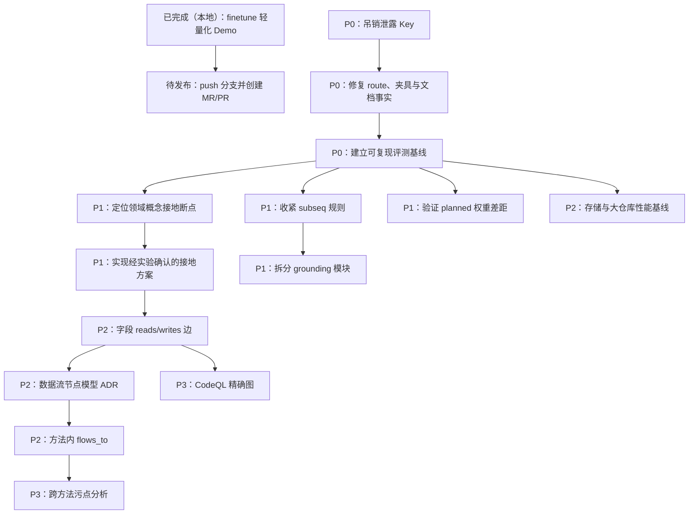

# CodeSense 后续工作计划

> 最近同步：2026-08-13

> **给后续执行者：** 按任务顺序逐项实施并更新复选框；开始执行前使用 `superpowers:executing-plans` 工作流，确保每项任务都有测试与复核节点。

**目标：** 先把已完成的 finetune Demo 发布到远端，并把当前实现、测试夹具和评测基线统一到同一事实版本；再围绕“领域概念如何落到项目命名”提升召回，最后按收益顺序补字段读写、数据流、精确代码图和多语言能力。

**架构原则：** 保持现有 `lang → text → indexing → index artifact → ql/search` 单向分层。模型只负责语义提议，项目统计负责校验和参数化；所有检索改动必须先在可复现 benchmark 中形成基线，再进入现役查询路径。

**技术栈：** Python ≥3.10（当前 conda `codesearch` 为 3.11.15）、tree-sitter、
srctoolkit、标准库 QL、pytest、ruff；可选 OpenAI-compatible LLM、gensim/fastText，
后期可选 CodeQL。

## 全局约束

- 运行命令前激活 conda 环境 `codesearch`。
- API Key 只从 `CODESENSE_API_KEY` 或未跟踪的 `config.yml` 读取，绝不写入源码、文档示例、测试或日志。
- `codesense/ql/` 只依赖标准库，不导入其它 `codesense` 子包；由 `tests/contract/test_ql_isolation.py` 强制。
- 参数必须从命令行一路注入构造函数，不在业务代码中写死路径、模型或阈值。
- 新业务实现进入 `codesense/`；`scripts/` 只做参数解析和调用；评测逻辑进入 `evaluation/`。
- 新行为必须按 RED → GREEN → REFACTOR 开发，先写失败测试。
- 每个任务结束运行 `ruff check .`、`ruff format --check .`、`pytest`。
- benchmark 的对照组和实验组一次只改变一个变量；涉及 LLM 时至少运行 3 个独立 attempt，并缓存模型派生产物。
- 不提交 `output/`、`runs/`、模型权重、目标项目源码、密钥或机器专属绝对路径。

---

## 1. 当前实现程度（2026-08-13 核对）

本节是后续 TODO 的事实基线。判断优先级为：**现役代码和测试 > 实测报告 > 设计稿 > 旧 CodeSearch 文档**。

### 1.1 已经完成

- QL 重写已经通过 `e0b7923` 合入 `main`；本地 `main` 当前 `HEAD` 是
  `cd3b893`。`origin/main` 仍停在 `63edb84`，本地领先 4 个提交，finetune 改造尚未
  push，也尚未创建 MR/PR。
- `Project.build/open/search`、`codesense init/query/info` 已经可用。
- `lexical`、`planned`、`codegen` 三条搜索 route 的实现均已落地，并设计了模型失败时降级到 lexical 的路径；但 planned 当前存在成功路径缺陷，planned/codegen 也缺少成功路径测试，见 1.3 和 Task 0A。
- `Frag`、证据模型、集合代数、`eval_unit`、`hop`、`reach`、`only`、`top`、`degree`、`intent` 已经实现。
- 生成脚本有 AST 白名单和执行步数预算，且测试保证 `Plan` 与生成脚本等价。
- Java adapter 已实现一次扫描提取声明、注解、注解参数、修饰符、调用和局部类型。
- 索引已分域保存 name、container、signature、doc、annotation、annotation_arg、modifier posting。
- 轻量图已经物化 `contains`，并用 receiver 类型或名称启发式生成 `calls`。
- 构建期 grounding 已有 lexical、vectors、finetune 三种策略；finetune 进一步提供
  `lightweight`、`full_force`、`warn_full` 三种 profile。默认 lightweight 使用紧凑
  基础包和 2GB 内存预算，项目模型保存到 `.codesense/embedding/project.model`；
  查询期只读取 index/expansion，不加载 embedding 模型。
- finetune Demo 已通过 `Project.build` 和 CLI 接线，baseline/adapted expansion 取较高分，
  full_force 使用 spawn 子进程提取完整 FastText 所需向量，warn_full 需要显式危险确认。
- 2026-08-13 当前工作树测试基线为 `512 passed, 20 deselected`；`ruff check .` 与
  `ruff format --check .` 均通过。

### 1.2 已实现但文档或夹具尚未跟上

- 注解和修饰符已经进入真实索引。当前本地 youlai 索引为 1,726 个符号、18,158 条 posting、2,426 条边，其中有 3,348 条 annotation posting、1,614 条 annotation_arg posting、1,772 条 modifier posting。
- `tests/fixtures/ql/mini_index.json` 是旧索引产物，导致 `TestGaps` 仍把 annotation/modifier 当作缺口。
- `scripts/build_ql_fixture.py` 仍读取旧版 `symbols_index.json` 和 `codegraph.sqlite`，不能从当前 `.codesense/meta.json + index.json` 重建夹具。
- `docs/README.md` 仍把 `docs/design/` 描述为“未实现”；`HANDOFF.md` 仍写重写未合入 main；`evaluation/README.md` 仍写评测目录为空。
- `codesense/ql/store/base.py` 的说明提到真实 SQLite store，但现役实现只有内存 store，当前索引仍从 JSON 全量物化到内存。
- 结构凝聚 `_cohere` 的“只改变临时排序、最终 `_rank` 又丢失 1.6 倍加权”问题已在
  当前工作树修复：boost 被保存成 structural evidence，并有分数、排序和解释测试；
  但 `codesense/search.py` 与 `tests/unit/test_search.py` 仍未提交，不能算正式完成。
- `docs/TODO.md`、算子参考、调试脚本等仍是未跟踪文件；同步 TODO 时不得把这些文件的
  存在误认为已经发布到仓库。

### 1.3 当前真正未解决

- netty-backpressure 在六条检索路径、三次采样中均为 0% 召回。
- `zero copy → FileRegion` 同样暴露出“领域概念 → 项目命名”的断点；仅把项目词表放进 prompt 还不够。
- lexical grounding 的 `subseq` 规则噪音多于信号，已知错误包括 `recycling → ring`、`abandoned → add`、`ability → alt`。
- benchmark 仍是单个脚本中的研究逻辑，索引身份、prompt 版本和 cache key 不足以保证跨运行可比。
- `codesense/search.py::_planned` 仍按旧签名调用 `build_spec`。实测会触发 `TypeError`，随后被通用降级逻辑吞掉，最终以 lexical route 返回；现有测试只检查 route 名称存在，没有覆盖 planned/codegen 的成功路径。
- 没有 `reads` / `writes` 字段访问边。
- 没有 `flows_to` 数据流边，而且当前符号级节点模型尚不能自然表达局部变量和参数的数据流。
- 只有 Java adapter；没有恢复旧项目的 code line、snippet、regex、精确 CodeQL、多语言现成支持。
- `codesense/indexing/grounding.py` 目前为 597 行，仍同时承担 lexical rule、旧
  FastText VectorSpace、finetune 调度和结果合并；新项目训练内部已经拆到
  `codesense/indexing/finetune/`（700 行），后续拆分 grounding 时不能把这部分重新揉回去。

### 1.4 不应再按旧路线继续实现的内容

以下文档属于旧 CodeSearch / SemCon → SemQL → 三执行器路线，只能作为历史和功能对照，不能直接当现役任务清单：

- `docs/search-pipeline.md`
- `docs/research-pipeline.md`
- `docs/semql-report.md`
- `docs/search-strategy-codegraph.md`
- `docs/schemas/ngramed-symbol.md`
- `docs/html/` 下的旧流水线可视化

---

## 2. 推进顺序



优先级摘要：

| 优先级 | 工作 | 原因 |
|---|---|---|
| P0 | 发布 finetune MR/PR、密钥吊销、夹具/文档校正、可复现 benchmark | 本地成果需先进入可 review 的远端状态；没有可信基线，后续效果判断都会读到噪音 |
| P1 | backpressure/zero-copy 诊断、subseq、planned 权重 | 直接决定当前检索质量，且已有真实失败案例 |
| P2 | reads/writes、数据流建模、存储性能 | 解锁新查询类别，但工作量和设计风险更高 |
| P3 | CodeQL、跨方法污点、多语言、snippet/regex | 扩能力上限，不应抢在核心召回问题之前 |

---

## Task 0：完成安全处置

**Files:**

- Verify: `HANDOFF.md`
- Verify: `ARCHITECTURE.md`
- No source change required unless安全状态需要记录

**Interfaces:**

- Consumes: DashScope 控制台和远端 Git 历史中的泄露事实。
- Produces: 已吊销的旧凭据和只存在于安全环境变量中的新凭据。

- [ ] **Step 1：在 DashScope 控制台吊销 `652a37f` 中出现过的 Key**

  不复制、不打印旧 Key；只按 commit 定位泄露事件。

- [ ] **Step 2：签发新 Key，并只写入本地环境**

  ```bash
  export CODESENSE_API_KEY='新签发的值'
  ```

- [ ] **Step 3：验证旧 Key 已拒绝、新 Key 可访问**

  用供应商控制台或一次最小 API 请求验证，不把响应头或凭据写入仓库。

- [ ] **Step 4：在 `HANDOFF.md` 将状态改为“已吊销，历史仍含泄露值”**

  只有实际完成吊销后才能勾选和修改，不能以“代码里已删除”代替。

**Acceptance:** 旧凭据不可用；`git grep`、测试日志和 `git status` 中没有新凭据。

---

## Task 0A：修复并锁定三条 route 的成功路径

**Files:**

- Modify: `codesense/search.py`
- Modify: `tests/unit/test_search.py`

**Interfaces:**

- Consumes: `QueryUnderstanding.understand(...) -> dict | None`。
- Consumes: `build_spec(query, terms, ctx, *, concept, annotations, groups, relations) -> tuple[QuerySpec, list[str]]`。
- Produces: planned/codegen/lexical 三条 route 都有无网络成功路径测试；只有真实失败才允许降级。

- [ ] **Step 1：为 planned 成功路径写失败测试**

  ```python
  def test_planned_route_reaches_the_planner(ctx, monkeypatch) -> None:
      monkeypatch.setattr(
          QueryUnderstanding,
          "understand",
          lambda *args: {
              "terms": {"alloc": 1.0},
              "groups": {},
              "relations": [],
              "annotations": [],
              "concept": "allocates a buffer",
          },
      )
      result = search("alloc", ctx, route="planned", llm=object())
      assert result.route == "planned"
      assert not any("fell back" in note for note in result.notes)
      assert result.script
  ```

- [ ] **Step 2：运行测试确认当前实现降级为 lexical**

  ```bash
  conda run -n codesearch pytest tests/unit/test_search.py \
    -k planned_route_reaches_the_planner -q
  ```

- [ ] **Step 3：按当前 `build_spec` 契约修复 `_planned`**

  调用必须显式拆开模型输出：

  ```python
  spec, validation_notes = build_spec(
      query,
      understood["terms"],
      ctx,
      concept=understood["concept"],
      annotations=understood["annotations"],
      groups=understood.get("groups") or None,
      relations=understood.get("relations", ()),
  )
  execution = plan(spec, ctx)
  state = execution.run(ctx)
  return state.current, to_script(execution, spec), [*validation_notes, *execution.reasoning]
  ```

- [ ] **Step 4：增加 codegen 成功路径测试**

  让 `ScriptGenerator.generate` 返回一个只使用白名单名称并产生 `answer` 的固定脚本，断言 route 保持 `codegen`、脚本被保存、结果不是 lexical fallback。测试不能访问网络。

- [ ] **Step 5：保留并复验真实失败降级**

  现有 endpoint 异常、空模型输出、非法脚本仍应产生带原因的 lexical fallback，不能因为成功路径修复而移除容错。

- [ ] **Step 6：验证并提交**

  ```bash
  conda run -n codesearch pytest tests/unit/test_search.py -q
  conda run -n codesearch ruff check .
  conda run -n codesearch ruff format --check .
  conda run -n codesearch pytest
  git add codesense/search.py tests/unit/test_search.py
  git commit -m "fix(search): execute the planned route through the current compiler"
  ```

**Acceptance:** 三条公开 route 都有成功路径回归测试；planned 不再把内部 API 漂移伪装成合法 lexical 搜索。

---

## Task 0B：发布已经完成的 finetune 轻量化 Demo

**当前状态：** 代码和测试已经在本地 `main` 完成；远端尚不可见。本任务只处理发布，
不继续扩展 finetune 功能。

**已完成：**

- [x] **Step 1：确定三种 profile 和最小 Demo 边界**

  已实现 `lightweight`、`full_force`、`warn_full`；删除离线基础包构建器、增量恢复、
  资源报告、通用 provider 框架等不在 Demo spec 中的重型设计。

- [x] **Step 2：实现紧凑词表、项目词初始化和 Word2Vec 训练**

  通用词冻结，项目词按 exact/canonical/components/subword/context/random 顺序初始化；
  项目模型持久化为 `.codesense/embedding/project.model`。

- [x] **Step 3：实现三种向量来源和双空间 expansion**

  lightweight 不调用 Facebook FastText loader；full_force 在 spawn 子进程导出所需行；
  warn_full 需要 `allow_unsafe_full=True`。baseline 与 adapted 映射取较高分，不累加。

- [x] **Step 4：接入 `Project.build`、CLI、meta 和磁盘语料**

  扫描时把 finetune corpus 写入临时 JSONL；构建失败按 `strict_profile` 选择抛错或
  lexical 降级；`Project.open().search()` 不加载 embedding 模型。

- [x] **Step 5：本地验证并 squash 到 `main`**

  本地提交为 `cd3b893 feat: add lightweight finetune demo`。2026-08-13 在包含当前
  工作树改动的环境中重新验证：`ruff check .`、`ruff format --check .` 通过，
  `512 passed, 20 deselected`。

**尚未完成：**

- [ ] **Step 6：把本地提交推到远程功能分支**

  建议使用 `codex/finetune-demo`。当前 `origin/main..main` 包含 4 个提交：三份设计提交
  和 `cd3b893`；不要把工作树中未提交的 coherence、文档或调试脚本混入发布分支。

- [ ] **Step 7：创建面向 `main` 的 MR/PR 并记录链接**

  MR/PR 描述应明确：默认 2GB 预算、三种 profile、查询期不加载模型、Demo 明确不做的
  能力和完整测试结果。远端可见前不能把本任务标记为“已交付”。

**Acceptance:** 远端存在可 review 的 finetune 分支和面向 `main` 的 MR/PR；diff 只包含
上述四个本地提交，不包含当前未提交工作树文件。

---

## Task 0C：完成结构凝聚分数修复的提交

**当前状态：** 行为修复和测试已经在工作树完成，但尚未提交。

- [x] **Step 1：复现 `_cohere` 只改变临时顺序的问题**

  旧实现只把乘以 `1.6` 的结果用于 `Frag.induced(...)` 排序；最终 `_rank` 会再次按原始
  `score_of` 排序，因此 boost 没有进入最终分数、解释和稳定排序。

- [x] **Step 2：把 boost 保存为 structural evidence**

  对处于强命中 1～2 跳 `calls/contains` 邻域内的现有候选，增加
  `base_score × 0.6` 的 `UnitHit`，使最终分数严格变成原分数的 `1.6` 倍；不新增候选，
  也不丢失原 lexical evidence。

- [x] **Step 3：覆盖分数、最终排序和解释**

  `tests/unit/test_search.py::TestStructuralCoherence` 已断言节点 2 从 `0.7` 变成
  `1.12`、最终排到第一位，并在 why 中出现 graph structural evidence。

- [ ] **Step 4：单独提交修复**

  只提交 `codesense/search.py`、`tests/unit/test_search.py` 以及对应的 2026-08-05
  plan/spec；不要夹带 `.gitignore`、TODO、调试脚本或其它文档。

**Acceptance:** coherence 修复形成独立提交；最终 `_rank`、Hit.score 和 Hit.why 都观察到
同一个 1.6 倍 boost，完整测试和 Ruff 继续通过。

---

## Task 1：让 QL fixture 与当前索引格式一致

**Files:**

- Create: `evaluation/__init__.py`
- Create: `evaluation/fixture.py`
- Create: `tests/unit/evaluation/test_fixture.py`
- Modify: `scripts/build_ql_fixture.py`
- Modify: `tests/fixtures/ql/mini_index.json`
- Modify: `tests/integration/test_handwritten_queries.py`

**Interfaces:**

- Consumes: `Index.load(index_dir)` 和当前 `Index.payload` 的 `symbols/postings/edges`。
- Produces: `build_fixture(index: Index, *, file_sample: int, anchor_files: Sequence[str]) -> dict[str, Any]`。
- Produces: 保留 modifiers、所有 posting field 和边元数据的当前格式小型夹具。

- [ ] **Step 1：为当前索引裁剪行为写失败测试**

  ```python
  def test_fixture_keeps_annotation_modifier_and_edge_fields(index: Index) -> None:
      payload = build_fixture(index, file_sample=40, anchor_files=("UserServiceImpl.java",))
      fields = {p["field"] for rows in payload["postings"].values() for p in rows}
      assert {"annotation", "annotation_arg", "modifier"} <= fields
      assert any(symbol["modifiers"] for symbol in payload["symbols"])
      assert {edge["kind"] for edge in payload["edges"]} >= {"contains", "calls"}
  ```

- [ ] **Step 2：运行测试确认它因 `evaluation.fixture` 不存在而失败**

  ```bash
  conda run -n codesearch pytest tests/unit/evaluation/test_fixture.py -q
  ```

- [ ] **Step 3：实现 `evaluation.fixture.build_fixture`**

  规则必须明确：

  - 先按 anchor file 和跨文件均匀采样得到保留的 symbol id；
  - symbols 保留 `modifiers`、doc、language 等当前字段；
  - postings 保留所有指向已保留 symbol 的记录，不能重新分词伪造；
  - edges 仅保留两端都在样本内的记录，并保留 `site/confidence/provenance`；
  - 夹具构造不读取旧 `symbols_index.json` 或 `codegraph.sqlite`。

- [ ] **Step 4：把 `scripts/build_ql_fixture.py` 缩成参数解析和调用**

  ```python
  index = Index.load(args.index)
  payload = build_fixture(index, file_sample=args.file_sample, anchor_files=ANCHOR_FILES)
  write_fixture(payload, args.out)
  ```

- [ ] **Step 5：从一个当前格式的 youlai 索引重建夹具**

  执行前由操作者设置目标项目路径：

  ```bash
  test -f "$CODESENSE_TARGET_REPO/.codesense/meta.json"
  conda run -n codesearch python scripts/build_ql_fixture.py \
    --index "$CODESENSE_TARGET_REPO/.codesense" \
    --out tests/fixtures/ql/mini_index.json
  ```

- [ ] **Step 6：把 gap1/gap3 改成正向能力测试**

  在 fixture loader 中读取 `modifiers`：

  ```python
  modifiers=frozenset(s.get("modifiers", ()))
  ```

  然后删除 `test_gap1_*` 与 `test_gap3_*`，增加：

  ```python
  def test_real_fixture_supports_annotation_queries(ctx: EvalContext) -> None:
      unit = QueryUnit("tx", satisfiers=(AnnotationSatisfier(names=("@Transactional",)),))
      assert eval_unit(unit, ctx)

  def test_real_fixture_supports_modifier_queries(ctx: EvalContext) -> None:
      unit = QueryUnit("static", satisfiers=(ModifierSatisfier(modifiers=("static",)),))
      assert eval_unit(unit, ctx)
  ```

- [ ] **Step 7：验证所有测试并提交**

  ```bash
  conda run -n codesearch pytest tests/unit/evaluation/test_fixture.py \
    tests/integration/test_handwritten_queries.py -q
  conda run -n codesearch ruff check .
  conda run -n codesearch ruff format --check .
  conda run -n codesearch pytest
  git add evaluation scripts/build_ql_fixture.py tests/fixtures/ql/mini_index.json \
    tests/integration/test_handwritten_queries.py tests/unit/evaluation/test_fixture.py
  git commit -m "test: rebuild QL fixture from the current index"
  ```

**Acceptance:** gap1/gap3 不再以“缺失能力”存在；夹具来自当前 `.codesense` 格式；gap2/gap4 继续准确失败式记录真实缺口。

---

## Task 2：统一项目文档的事实版本

**Files:**

- Modify: `HANDOFF.md`
- Modify: `docs/README.md`
- Modify: `docs/design/README.md`
- Modify: `evaluation/README.md`
- Modify: `README.md`
- Modify: `ARCHITECTURE.md`
- Modify: `docs/search-pipeline.md`
- Modify: `docs/research-pipeline.md`
- Modify: `docs/semql-report.md`
- Modify: `docs/search-strategy-codegraph.md`
- Modify: `docs/schemas/ngramed-symbol.md`

**Interfaces:**

- Consumes: Task 1 的真实 fixture 状态和当前 `main` 提交历史。
- Produces: 明确区分“现役实现 / 目标设计 / 旧实现参考”的文档索引。

- [ ] **Step 1：更新 `HANDOFF.md` 当前状态**

  必须改正：QL 已合入 main、真实索引已有 annotation/modifier、finetune Demo 已在本地
  main 但尚未发布远端、当前测试数为 512、实际环境中存在 conda `codesearch`。

- [ ] **Step 2：更新 `docs/README.md` 和 `docs/design/README.md`**

  `docs/design/` 的状态应写成“设计已部分落地，章节同时包含目标与实测回填”，并链接 `docs/report-pipeline.md` 和 `docs/ql-operator-reference.md` 作为当前能力事实来源。

- [ ] **Step 3：给旧 CodeSearch 文档添加统一历史横幅**

  横幅内容固定为：

  ```markdown
  > **历史文档。** 本文描述重写前的 CodeSearch / SemCon → SemQL → 三执行器路线；现役实现见 `codesense/ql/`、`docs/report-pipeline.md` 和 `docs/ql-operator-reference.md`。
  ```

- [ ] **Step 4：更新 `evaluation/README.md`**

  删除“目前为空”，记录现有八条 query、gold 只保证确凿不保证完备、当前只能严谨解释 Recall@K，并指向 `scripts/run_benchmark.py`。

- [ ] **Step 5：扫描残余矛盾**

  ```bash
  rg -n "初稿，未实现|从未合进 main|evaluation/.*空|真实索引.*没有注解|真实索引.*没有修饰符" \
    HANDOFF.md README.md ARCHITECTURE.md docs evaluation
  ```

  每个命中必须是被引用的历史结论，或者被明确历史横幅覆盖。

- [ ] **Step 6：提交**

  ```bash
  git add HANDOFF.md README.md ARCHITECTURE.md docs/README.md docs/design/README.md \
    docs/search-pipeline.md docs/research-pipeline.md docs/semql-report.md \
    docs/search-strategy-codegraph.md docs/schemas/ngramed-symbol.md evaluation/README.md
  git commit -m "docs: align the roadmap with the landed QL pipeline"
  ```

**Acceptance:** 新接手者只读 `README → HANDOFF → report-pipeline → ql-operator-reference` 不会再得到互相冲突的实现状态。

---

## Task 3：建立可复现的 benchmark 基线

**Files:**

- Create: `evaluation/models.py`
- Create: `evaluation/metrics.py`
- Create: `evaluation/harness.py`
- Create: `tests/unit/evaluation/test_metrics.py`
- Create: `tests/unit/evaluation/test_harness.py`
- Modify: `scripts/run_benchmark.py`
- Modify: `evaluation/benchmark/queries.json`
- Create: `experiments/EXP-0001-current-baseline/config.yaml`
- Create: `experiments/EXP-0001-current-baseline/README.md`

**Interfaces:**

- Produces: `BenchmarkCase(id: str, project: str, query: str, gold: tuple[str, ...])`。
- Produces: `IndexIdentity(project: str, directory: Path, fingerprint: str)`。
- Produces: `cache_key(*, route: str, model: str, prompt_version: str, query: str, vocabulary: Sequence[tuple[str, int]], index_fingerprint: str, attempt: int) -> str`。
- Produces: `recall_at(ranks: Mapping[str, int], gold: Sequence[str], cutoff: int) -> float`。
- Produces: `run_benchmark(cases, indexes, config) -> BenchmarkReport`。

- [ ] **Step 1：写指标和 cache identity 的失败测试**

  ```python
  def test_cache_key_changes_when_index_content_changes() -> None:
      first = cache_key(index_fingerprint="a", vocabulary=(("buffer", 10),), **COMMON)
      second = cache_key(index_fingerprint="b", vocabulary=(("buffer", 10),), **COMMON)
      assert first != second

  def test_cache_key_uses_vocabulary_content_not_only_length() -> None:
      first = cache_key(vocabulary=(("buffer", 10),), **COMMON)
      second = cache_key(vocabulary=(("watermark", 2),), **COMMON)
      assert first != second
  ```

- [ ] **Step 2：运行测试确认失败**

  ```bash
  conda run -n codesearch pytest tests/unit/evaluation/test_metrics.py \
    tests/unit/evaluation/test_harness.py -q
  ```

- [ ] **Step 3：把 benchmark 业务逻辑移出 `scripts/`**

  `scripts/run_benchmark.py` 最终只允许：解析 `--index project=directory`、查询文件、模型、attempt、cache、dump，然后调用 `evaluation.harness.main`。

- [ ] **Step 4：实现索引 fingerprint**

  fingerprint 必须至少覆盖 `meta.json`、`index.json`、`expansion.json` 的内容哈希；不能只使用词表长度、文件时间或 symbol 数量。

- [ ] **Step 5：扩充 cache key 和运行归档**

  每个结果记录：CodeSense git commit、工作区是否 dirty、Python 版本、模型、prompt version、attempt、索引 fingerprint、route、耗时、命中排名和 notes。

- [ ] **Step 6：为三个 benchmark 仓库建立版本清单**

  `evaluation/benchmark/queries.json` 的 project 元数据必须记录 repository URL 和实际 revision。revision 由下列命令取得，不手填猜测：

  ```bash
  git -C "$CODESENSE_NETTY_REPO" rev-parse HEAD
  git -C "$CODESENSE_HIKARI_REPO" rev-parse HEAD
  git -C "$CODESENSE_PETCLINIC_REPO" rev-parse HEAD
  ```

- [ ] **Step 7：运行并记录当前基线**

  每个 LLM arm 运行 attempts `0,1,2`，同时保存逐 query 排名和均值。`EXP-0001` 的 README 在运行前先写“问题、假设、唯一变量”，运行后补结果和结论。

- [ ] **Step 8：验证缓存可复现性**

  第二次使用相同 index、attempt、prompt 和 model 运行时必须 100% 命中派生缓存；替换任何一个 index fingerprint 后必须 cache miss。

- [ ] **Step 9：提交**

  ```bash
  conda run -n codesearch ruff check .
  conda run -n codesearch ruff format --check .
  conda run -n codesearch pytest
  git add evaluation scripts/run_benchmark.py tests/unit/evaluation \
    experiments/EXP-0001-current-baseline
  git commit -m "feat(evaluation): make retrieval benchmarks reproducible"
  ```

**Acceptance:** 任意分数都能追溯到确定的代码提交、索引内容、prompt、模型和 attempt；跨 index 不可能误复用缓存。

---

## Task 4：定位“领域概念 → 项目命名”的断点

**Files:**

- Create: `experiments/EXP-0002-project-concept-grounding/config.yaml`
- Create: `experiments/EXP-0002-project-concept-grounding/README.md`
- Modify only if needed for trace output: `evaluation/harness.py`
- Test trace changes in: `tests/unit/evaluation/test_harness.py`

**Interfaces:**

- Consumes: Task 3 的固定 index fingerprint 和 cache。
- Produces: 对每条漏检 query 的四段 trace：`prompt vocabulary → LLM selected terms → eval_unit candidates → final ranks`。
- Produces: 明确的 failure classification，而不是先选一个修复方案。

- [ ] **Step 1：在实验 README 中写清问题和假设**

  只分析 `netty-backpressure` 与 `netty-zerocopy`：

  - H1：关键项目词没有进入 prompt shortlist；
  - H2：关键词已进入 prompt，但模型没有选择；
  - H3：模型选择正确，但 posting/评分/图重排把 gold 排出 Top-100。

- [ ] **Step 2：补齐逐阶段 trace**

  dump 中必须包含每个关键词的 df、词表全局排名、是否进入 prompt、是否被模型选择、首次命中 symbol 数和 gold 最终 rank。

- [ ] **Step 3：建立三个单变量实验臂**

  ```yaml
  attempts: [0, 1, 2, 3, 4]
  vocab_limit: 1200
  arms:
    - current
    - oracle_include_gold_terms
    - vocabulary_with_symbol_context
  queries:
    - netty-backpressure
    - netty-zerocopy
  ```

  `oracle_include_gold_terms` 只用于判断 shortlist 上限，不能进入产品；`vocabulary_with_symbol_context` 给词附一两个代表 symbol/container/doc 摘要，用来验证“仅词和 df 是否信息不足”。

- [ ] **Step 4：运行五次独立 attempt 并比较阶段漏斗**

  不能只看平均 Recall@100；必须指出第一个清零阶段。

- [ ] **Step 5：形成唯一结论**

  README 的结论只能落入 H1/H2/H3 或其明确组合，并写出数据证据。若 `oracle` 仍失败，停止调整 prompt shortlist，转查评分或索引。

- [ ] **Step 6：为胜出方向另开实现计划**

  只有实验显示效果超过自身运行方差，才把对应方案接入 `codesense/search.py` 或 `codesense/llm/`。产品改动必须在完整八条 query 上证明平均 Recall@100 不退化。

- [ ] **Step 7：提交实验定义和结论**

  ```bash
  git add experiments/EXP-0002-project-concept-grounding evaluation tests/unit/evaluation
  git commit -m "exp: locate the project concept grounding failure"
  ```

**Acceptance:** 能准确回答 backpressure 是“没看见 watermark”、 “看见但没选”、还是“选了但没排上”；在回答前不进入算法实现。

---

## Task 5：用标注和消融决定 subseq 的去留

**Files:**

- Create: `evaluation/grounding/lexical_pairs.json`
- Create: `evaluation/grounding/metrics.py`
- Create: `tests/unit/evaluation/test_grounding_metrics.py`
- Create: `experiments/EXP-0003-subsequence-grounding/config.yaml`
- Create: `experiments/EXP-0003-subsequence-grounding/README.md`
- Modify after experiment: `codesense/indexing/grounding.py`
- Modify: `tests/unit/indexing/test_grounding.py`

**Interfaces:**

- Produces: 至少 50 条 `{query_form, project_form, expected, reason}` 标注。
- Produces: `evaluate_expansions(table, pairs) -> {precision, recall, false_positives, false_negatives}`。

- [ ] **Step 1：建立小型 grounding gold set**

  正例至少包含 `context→ctx`、`message→msg`、`configuration→cfg`、`implementation→impl`、`manager→mgr`、`buffer→buf`；负例至少包含 `recycling→ring`、`abandoned→add`、`ability→alt`。其余样本从真实 expansion 表按 prefix/abbrev/subseq 分层抽取并人工标注，不能只挑容易的例子。

- [ ] **Step 2：先为度量和已知错误写失败测试**

  ```python
  def test_known_false_positive_is_rejected() -> None:
      assert not proposed_rule("ring", "recycling")

  def test_ctx_context_remains_supported() -> None:
      assert proposed_rule("ctx", "context")
  ```

- [ ] **Step 3：先做“完全关闭 subseq”的消融**

  对比 current 与 no-subseq，固定其它 grounding、索引、缓存和 query。若关闭后八条 query 的 Recall@100 不下降，并且 pooled buffer 查询的 Top-10 噪音减少，直接删除 subseq，比继续堆规则更简单。

- [ ] **Step 4：只有关闭造成真实召回损失时才设计新门禁**

  新门禁以 gold-set precision/recall 选择，不以个别例子拍阈值；所有阈值通过 `GroundingConfig` 注入。

- [ ] **Step 5：实现最小规则并更新证据 reason**

  保留的 mapping 必须继续记录 `prefix`、`abbrev` 或更具体的 subseq reason，便于从结果反查噪声来源。

- [ ] **Step 6：运行单测、gold set 和完整 benchmark**

  验收要求：已知三个 false positive 消失；`context→ctx` 等核心正例保留；完整 benchmark Recall@100 不低于固定基线。

- [ ] **Step 7：提交**

  ```bash
  git add evaluation/grounding tests/unit/evaluation tests/unit/indexing/test_grounding.py \
    experiments/EXP-0003-subsequence-grounding codesense/indexing/grounding.py
  git commit -m "fix(indexing): remove noisy subsequence grounding"
  ```

**Acceptance:** subseq 是否保留由标注和端到端消融决定；不能再出现“规则数量最大但质量最差、仍默认启用”的状态。

---

## Task 6：验证 planned route 剩余差距是否来自 term 权重

**Files:**

- Create: `experiments/EXP-0004-planned-term-weights/config.yaml`
- Create: `experiments/EXP-0004-planned-term-weights/README.md`
- Modify for experiment arm: `evaluation/harness.py`
- Modify after evidence only: `codesense/ql/compile/build.py`
- Test after evidence only: `tests/unit/ql/compile/test_build.py`

**Interfaces:**

- Consumes: 完全相同的 `QueryUnderstanding` 缓存。
- Produces: 三个只改变 term weight 的 arms：`model_weighted`、`equal_weighted`、`clipped_weighted`。

- [ ] **Step 1：固定同一份模型解析结果**

  三个 arms 必须复用同一份 terms/groups/relations，禁止分别调用 LLM。

- [ ] **Step 2：增加权重消融臂**

  `equal_weighted` 把所有已选 term 设为 1.0；`clipped_weighted` 将模型分数限制在 `[0.5, 1.0]`；其它 planner、图和 Narrow 完全不变。

- [ ] **Step 3：运行完整 benchmark**

  重点比较 planned 与手工单单元/graph 的差距，同时检查 annotation-only 两条 query 不退化。

- [ ] **Step 4：只在证据支持时修改 `build_spec`**

  若 equal 或 clipped 明显胜出，再为 `_normalise` / Term weight 写失败测试并实现；若没有胜出，关闭该方向，不继续调参。

- [ ] **Step 5：提交实验结论**

  ```bash
  git add experiments/EXP-0004-planned-term-weights evaluation
  git commit -m "exp: measure planned term weighting"
  ```

**Acceptance:** 对“planned 还差的百分点可能来自词权重”给出可复现实验证据，不把候选原因继续当既定事实。

---

## Task 7：在行为稳定后拆分 grounding 模块

**Files:**

- Create: `codesense/indexing/grounding/__init__.py`
- Create: `codesense/indexing/grounding/config.py`
- Create: `codesense/indexing/grounding/rules.py`
- Create: `codesense/indexing/grounding/vectors.py`
- Create: `codesense/indexing/grounding/merge.py`
- Delete after migration: `codesense/indexing/grounding.py`
- Modify imports: `codesense/project.py`, `codesense/cli.py`, tests

**Interfaces:**

- Preserve: `from codesense.indexing.grounding import GroundingConfig, GroundingOutcome, STRATEGIES, VectorSpace, ground_vocabulary` 等现有公开导入。
- `rules.py` 只负责 lexical mapping。
- `vectors.py` 只负责旧 pretrained FastText `VectorSpace` 的加载和 ground；项目级 finetune
  继续留在现有 `codesense/indexing/finetune/`，不得迁回 grounding package。
- `merge.py` 只负责 discriminating target、分数组合与截断。

- [ ] **Step 1：先运行 grounding 测试并保存基线输出**

  ```bash
  conda run -n codesearch pytest tests/unit/indexing/test_grounding.py -q
  ```

- [ ] **Step 2：建立 package 并保持公开导入不变**

  `__init__.py` 只重导出已有 API，不引入新默认值或新行为。

- [ ] **Step 3：按职责逐段移动代码**

  每移动一个职责立即跑 `test_grounding.py`，避免一次大搬迁无法定位差异。

- [ ] **Step 4：比较一个固定项目的 expansion.json 内容**

  重构前后同参数构建得到的 JSON 必须逐项相同；若 Task 5 已改变规则，则以 Task 5 完成后的输出作为基线。

- [ ] **Step 5：完整验证并提交**

  ```bash
  conda run -n codesearch ruff check .
  conda run -n codesearch ruff format --check .
  conda run -n codesearch pytest
  git add codesense/indexing/grounding codesense/project.py codesense/cli.py tests
  git commit -m "refactor(indexing): split grounding by responsibility"
  ```

**Acceptance:** 公开 API 和 expansion 输出不变；没有单个 grounding 文件同时承担规则、模型和合并三种职责。

---

## Task 8：实现 Java 字段 reads/writes 边

**Files:**

- Modify: `codesense/lang/base.py`
- Modify: `codesense/lang/java/scanner.py`
- Modify: `codesense/indexing/graph.py`
- Modify: `codesense/index.py`
- Modify: `tests/unit/lang/test_java_scanner.py`
- Modify: `tests/unit/indexing/test_index_build.py`
- Modify: `tests/integration/test_handwritten_queries.py`

**Interfaces:**

- Produces: `MemberAccess(name: str, receiver: str = "", mode: str = "read", line: int = 0)`。
- Extend: `Declaration.member_accesses: tuple[MemberAccess, ...] = ()`。
- Produces graph edge kinds: `reads` 和 `writes`，方向统一为 `callable → field`。
- Edge `site` 记录访问发生的源码位置，`provenance` 记录解析方式。

- [ ] **Step 1：为 Java 字段访问写扫描器失败测试**

  ```python
  def test_compound_assignment_is_both_read_and_write(scanner) -> None:
      declaration = method(scanner, "void bump() { this.count += 1; }")
      assert MemberAccess("count", "this", "read", 1) in declaration.member_accesses
      assert MemberAccess("count", "this", "write", 1) in declaration.member_accesses
  ```

  另测普通赋值、读取、`++/--`、局部变量遮蔽和带 receiver 的字段。

- [ ] **Step 2：实现 tree-sitter 字段访问抽取**

  只产出语法事实，不在 scanner 中解析 symbol id；符号解析继续由 `GraphBuilder` 负责。

- [ ] **Step 3：让 `GraphBuilder` 保存字段 symbol id 并解析访问**

  同类 `this.field` 可给高置信度；receiver 类型可解析时按类型表绑定；仅名称匹配时沿用低置信度并限制候选数。

- [ ] **Step 4：序列化和加载 `site`**

  `Index.to_context()` 构造 `Edge` 时必须读取 `site`，避免索引写了位置、查询层却丢掉。

- [ ] **Step 5：把 gap2 改成正向集成测试**

  ```python
  writers = reach(field, ctx, edge="writes", direction="backward", hops=1)
  assert expected_writer in {element.name for element in writers}
  ```

- [ ] **Step 6：验证并提交**

  ```bash
  conda run -n codesearch pytest tests/unit/lang/test_java_scanner.py \
    tests/unit/indexing/test_index_build.py tests/integration/test_handwritten_queries.py -q
  conda run -n codesearch ruff check .
  conda run -n codesearch ruff format --check .
  conda run -n codesearch pytest
  git add codesense/lang/base.py codesense/lang/java/scanner.py \
    codesense/indexing/graph.py codesense/index.py \
    tests/unit/lang/test_java_scanner.py tests/unit/indexing/test_index_build.py \
    tests/integration/test_handwritten_queries.py
  git commit -m "feat(indexing): add Java field read and write edges"
  ```

**Acceptance:** “谁读取/修改这个字段”可以由现有 `reach/hop` 表达，边带方向、置信度、来源和访问位置。

---

## Task 9：先决定数据流的节点粒度，再实现 `flows_to`

**Files:**

- Create: `docs/decisions/0002-dataflow-node-granularity.md`
- Modify after ADR: `codesense/lang/base.py`
- Modify after ADR: `codesense/lang/java/scanner.py`
- Modify after ADR: `codesense/indexing/graph.py`
- Modify after ADR: `codesense/index.py`
- Modify after ADR: `tests/integration/test_handwritten_queries.py`

**Interfaces:**

- Consumes: 当前 `Element` 只表示声明，参数和局部变量默认不进入 symbol index 的事实。
- Produces: 一份接受状态的 ADR，明确 `flows_to` 两端究竟是声明、隐藏图节点还是 statement/site。
- Produces after ADR: 方法内数据流边；跨方法污点不在本任务内。

- [ ] **Step 1：用三个真实 query 检验节点模型**

  必须覆盖：参数值来源、字段值写入路径、返回值由哪个调用产生。每种候选表示都要写出最终 `Frag` 会包含什么、用户看到什么。

- [ ] **Step 2：在 ADR 中比较三个方案**

  1. 把 parameter/local/statement 都变成普通 `Element`；
  2. 增加只在图中存在、默认不参与 lexical retrieval 的隐藏节点；
  3. 保持 symbol-only 节点，把方法内 def-use 作为 edge site/attrs。

  决策标准固定为：查询表达力、索引规模、证据可解释性、与 `Frag` 不变量的兼容性、后续 CodeQL 对接成本。

- [ ] **Step 3：提交 ADR，未定之前不写生产数据流代码**

  ```bash
  git add docs/decisions/0002-dataflow-node-granularity.md
  git commit -m "docs(adr): decide dataflow node granularity"
  ```

- [ ] **Step 4：按 ADR 写方法内数据流失败测试**

  至少覆盖赋值链、方法参数到字段、调用返回值到返回语句；先只做单方法，不做跨方法污点。

- [ ] **Step 5：实现轻量方法内 `flows_to` 并替换 gap4**

  每条边必须记录 `provenance="java_ast_local_flow"` 和置信度；无法确定时宁可不建边，不能制造确定关系。

- [ ] **Step 6：验证并提交**

  ```bash
  conda run -n codesearch ruff check .
  conda run -n codesearch ruff format --check .
  conda run -n codesearch pytest
  git add codesense/lang/base.py codesense/lang/java/scanner.py \
    codesense/indexing/graph.py codesense/index.py \
    tests/integration/test_handwritten_queries.py \
    docs/decisions/0002-dataflow-node-granularity.md
  git commit -m "feat(indexing): add method-local dataflow edges"
  ```

**Acceptance:** gap4 被正向测试替代；当前 symbol-only 设计与数据流节点之间不再靠隐含假设连接。

---

## Task 10：为大仓库测量并决定存储后端

**Files:**

- Create: `experiments/EXP-0005-index-storage/config.yaml`
- Create: `experiments/EXP-0005-index-storage/README.md`
- Create only if measurements justify it: `codesense/ql/store/sqlite.py`
- Modify only if measurements justify it: `codesense/index.py`
- Test only if implemented: `tests/unit/ql/test_sqlite_store.py`

**Interfaces:**

- Measures: `Project.open` 时间、首次 `project.context` 时间、峰值 RSS、一次 `eval_unit`、一次 `reach`、一次 `hop`。
- Candidate implementation: `SQLiteSymbolStore`、`SQLitePostingIndex`、`SQLiteEdgeStore`，全部实现现有 store ABC。

- [ ] **Step 1：先在 youlai 和 netty 量当前 JSON + memory 后端**

  记录 index 文件大小、加载时间、峰值内存和查询延迟，不根据 docstring 猜瓶颈。

- [ ] **Step 2：写决策阈值**

  只有 netty 级项目的首次 context 峰值内存或延迟超出项目目标时才实现 SQLite；否则修正文档中“已有 SQLite real store”的错误描述即可。

- [ ] **Step 3：若需要 SQLite，先写 store 合同测试**

  同一批 symbols/postings/edges 在 InMemory 与 SQLite store 上运行 `eval_unit/reach/hop/degree`，节点、边和分数必须一致。

- [ ] **Step 4：实现并通过同构测试**

  QL 算子不得感知存储类型；切换只发生在 `Index.to_context()` 或新的 context factory。

**Acceptance:** 存储重写由测量触发；文档与实际后端一致；若引入 SQLite，查询结果与内存实现等价。

---

## 3. P3 Backlog：在核心质量稳定后再启动

以下任务必须分别建立独立 implementation plan，不在同一分支并行开发。

### 3.1 CodeQL 精确图

- 先把 CodeQL 定位为可选的离线索引增强器，不进入默认交互查询路径。
- 先物化 `calls` / `calls_virtual` / `implements`，再评估是否真的改善图相关 benchmark。
- CodeQL 数据库必须按目标仓库 commit 缓存；调整 `.ql` 查询时不能强制重建数据库。
- 只有轻量 AST 图在虚分派、泛型或跨库调用上形成可量化漏召回时启动。

### 3.2 跨方法污点分析

- 依赖 Task 9 的数据流节点 ADR 和方法内 `flows_to`。
- 必须显式使用单独 route/operator 参数，不能让普通 `hop(edge="flows_to")` 隐式触发分钟级 CodeQL。
- 需要独立超时、缓存、成本提示和结果 provenance。

### 3.3 第二门语言

- 优先选择 Python 或 TypeScript 中真实 benchmark 查询最多的一门，不按“adapter 好写”决定。
- 只新增 `codesense/lang/<language>/`；若需要修改通用 indexing，先判断 Language 协议是否真的缺能力。
- 必须复用相同 fixture、QL operator 和 benchmark harness，不能建立第二套查询链。

### 3.4 code line / snippet / regex 能力

- 先从用户查询样本统计符号级搜索覆盖不了的比例。
- 若比例足够高，再设计独立 satisfier；不能把源码正文直接塞进现有 name/signature posting。
- regex 必须有执行预算和文件范围限制，避免对全仓库无界扫描。

### 3.5 元素级 semantic satisfier

- 当前构建期向量只生成 term expansion，不等于已有 `SemanticSatisfier`。
- 启动前先定义元素文本表示、向量版本、增量重建触发条件和与 lexical evidence 的合成方式。
- 通过 benchmark 证明它能补到 lexical + graph 漏掉的 gold 后再进入 QL 白名单。

### 3.6 索引能力声明与 co-change

- 在新增 reads/writes、flows_to 或语言 adapter 时，让索引显式声明 `edge_kinds`、语言和可用 signal；编译器必须在生成脚本前知道能力缺失，不能把“没有这类边”误报成“没有这种代码”。
- `co_change` 继续作为独立研究工具候选，不直接伪装成代码结构边。只有真实 query 证明它能补充检索时，才为它建立独立实验和 API 设计。

---

## 4. 每个阶段的退出条件

### P0 退出条件

- finetune 的本地 4 个提交已推到远程功能分支，并有面向 `main` 的 MR/PR。
- 泄露 Key 已吊销。
- lexical、planned、codegen 三条 route 都有不访问网络的成功路径测试，planned 不再静默降级。
- docs、HANDOFF、fixture 和当前 main 不再互相矛盾。
- benchmark cache 绑定 index fingerprint、prompt、模型、vocabulary 内容和 attempt。
- 完整测试、Ruff、格式检查通过。

### P1 退出条件

- backpressure/zero-copy 的第一个失败阶段已被数据定位。
- 至少一个非 oracle 方案让 netty-backpressure Recall@100 从 0 变为非 0，且完整基线无显著退化；如果实验表明当前架构无法做到，也必须记录清晰的负面结论。
- subseq 规则有人工 gold set，已知 false positives 不再进入结果。
- planned term weight 猜测已被证实或否决。

### P2 退出条件

- reads/writes 和方法内 flows_to 均有真实 fixture 的正向查询测试。
- 数据流节点粒度有 ADR，不再是设计文档中的隐含空白。
- 大仓库的加载、内存和查询延迟已有测量；存储后端与文档一致。

### P3 退出条件

- 每项新增能力都有独立 benchmark query 和 gold，不以“代码写完”作为完成标准。
- 可选重型能力不会破坏“只需源码即可建立基础索引”的默认体验。
- 新语言和新 satisfier 不破坏 QL 标准库隔离及统一 `Frag`/证据模型。

---

## 5. 当前建议立即开始的六件事

1. 完成 Task 0B Step 6～7：推送 `codex/finetune-demo` 并创建面向 `main` 的 MR/PR。
2. 完成 Task 0C Step 4：把已经验证的 coherence 1.6 倍修复形成独立提交。
3. 完成 Task 0：吊销泄露 Key。
4. 完成 Task 0A：修复 planned route，并给 planned/codegen 增加成功路径测试。
5. 完成 Task 1：重写 fixture builder、重建 `mini_index.json`、把 gap1/gap3 改成正向测试。
6. 完成 Task 3：在继续调 grounding 之前，把 index fingerprint 和实验归档补齐。

在这些事项完成前，不建议直接开发 CodeQL、跨方法数据流或第二门语言；这些工作更大，
但无法解决当前最明确的发布缺口和真实失败案例。
